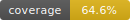

# go53

**go53** is a focused, API-driven authoritative DNS server written in Go. It is designed to be lightweight, fast, and easy to deploy, while offering extensibility and transparency through a well-structured API and modern design principles.

## Why go53?

Many existing DNS solutions attempt to cover both recursive and authoritative functionality, often resulting in bloated systems with steep learning curves or poor automation support. In contrast, `go53` is built from scratch to provide a clean, authoritative-only DNS server that is easy to manage through a structured API.

The goal of go53 is to bring clarity to authoritative DNS management, enabling sysadmins, DevOps engineers, and infrastructure teams to define and automate DNS zones without dealing with file-based or manual processes. By limiting its scope, go53 delivers predictable behavior and high performance while remaining flexible to integrate into modern infrastructure.

## Architecture

- **Written in Go**: A modern systems language with built-in concurrency and static binaries.
- **In-memory zone handling**: All active zones are managed in-memory for ultra-fast lookup performance.
- **Pluggable storage backend**:
    - **BadgerDB (default)**: A fast, embeddable key-value store with no external dependencies.
    - **PostgreSQL**: Optional support for environments requiring shared state, high availability, or external DB integration.

## Project Snapshot

- **Authoritative DNS**: UDP/TCP DNS serving with zone data managed through HTTP API routes.
- **DNSSEC**: Query-time signing, cached RRSIGs, NSEC/NSEC3 denial, and key lifecycle metadata.
- **Distributed mode**: Persistent TLS socket replication with signed events, vector clocks, and Merkle repair.

## Implemented

Completed items are shown as struck-through roadmap entries with the RFCs or protocol references they target.

- ~~**Authoritative DNS over UDP and TCP**~~
  Authoritative query handling, TCP fallback paths, CHAOS version response, and no recursive service scope.
  References: RFC 1034, RFC 1035, RFC 7766.

- ~~**EDNS-aware responses**~~
  Configurable EDNS enablement and UDP payload sizing for modern resolver interoperability.
  References: RFC 6891.

- ~~**API-managed zones and RRsets**~~
  HTTP API routes for zone record creation, lookup, deletion, TSIG keys, DNSSEC keys, and runtime config.
  References: RFC 1035, JSON API.

- ~~**AXFR, IXFR, and NOTIFY paths**~~
  Zone transfer handling, SOA serial behavior, transfer ACLs, DNSSEC material in AXFR, and NOTIFY scheduling.
  References: RFC 1995, RFC 1996, RFC 5936.

- ~~**TSIG validation and key API**~~
  TSIG key storage, API management, transfer enforcement option, and distributed TSIG key replication.
  References: RFC 2845, RFC 4635.

- ~~**DNSSEC signing and denial**~~
  DNSKEY/RRSIG support, query-time signing cache, NSEC/NSEC3 chains, wildcard denial, and no-data proofs.
  References: RFC 4033, RFC 4034, RFC 4035, RFC 5155.

- ~~**DNSSEC key lifecycle and parent signaling**~~
  KSK/ZSK metadata, rollover helpers, revoke/retire timing, DS, CDS, and CDNSKEY endpoints.
  References: RFC 5011, RFC 7344, RFC 8078.

- ~~**CNAME and DNAME DNSSEC chains**~~
  Signed answer-chain handling and denial coverage around target and no-data cases.
  References: RFC 6672, RFC 4035.

- ~~**Canonical DNSSEC ordering**~~
  Canonical owner-name comparison for escaped labels, case folding, IDNA, root, and wildcard names.
  References: RFC 4034.

- ~~**Distributed mode**~~
  Signed event replication over persistent TCP/TLS, vector clocks, Merkle repair, and config/key/zone event coverage.
  References: TLS 1.3, Ed25519, internal go53 frame protocol.

- ~~**go53ctl cluster onboarding**~~
  JWT invite creation, one-time invite consume, self-registering joins, and generated distributed node keys.
  References: RFC 7519, EdDSA.

- ~~**In-memory read path with persistent mutations**~~
  Zone and DNSSEC key material are loaded for read-heavy serving, while Badger persists changes.
  References: BadgerDB, go53 storage model.

## DNSSEC and Replication

The current beta focus is validation quality: interoperability testing with common validating resolvers, transfer edge cases, and operational hardening around distributed cluster membership.

The DNSSEC implementation is built around RFC 4033/4034/4035 behavior, with NSEC3 coverage from RFC 5155 and parent signaling through CDS/CDNSKEY endpoints.

Distributed mode is go53's multi-node replication mode. Nodes exchange signed events over persistent socket transport, track vector-clock state, and use Merkle roots/branches for integrity repair.

## Future Work

These items remain planned or intentionally deferred until the beta test surface is stable.

- **API authentication and authorization**
  Define production auth for all API routes, including operator roles, token lifecycle, and secure automation.

- **Resolver interoperability matrix**
  Automated validation against BIND, Knot, Unbound, PowerDNS Recursor, and common secondary setups.

- **DoT listener**
  Native DNS-over-TLS listener for authoritative service once the core DNS and auth surfaces settle.
  Reference: RFC 7858.

- **Metrics and structured observability**
  Prometheus metrics, structured query/error logging, and operational health endpoints.

- **NSID support**
  EDNS NSID response support for node identification and anycast-style operations.
  Reference: RFC 5001.

- **ANY-query policy**
  Controlled ANY response behavior to reduce amplification exposure while preserving useful diagnostics.
  Reference: RFC 8482.

- **Catalog zones**
  Optional catalog-zone workflow for secondary provisioning and fleet-scale zone membership.
  Reference: RFC 9432.

- **Import/export tooling**
  Zone-file import/export and safer administrative workflows around bulk changes.

## Documentation

- [Administrator Guide](docs/admin_guide/) - primary/secondary/distributed setup, API examples, DNSSEC, TSIG, transfers, and `go53ctl` workflows.
- [Config Reference](docs/config/) - every environment and live config parameter with type, default, and implementation effect.
- [Storage Notes](docs/internal/storage.md) - internal notes for persistence behavior and storage layout.

## When NOT to use go53

If you're looking for a DNS server that supports:

- Recursive DNS resolution
- Service discovery
- Dynamic backend plugins (e.g. for Kubernetes)
- Load balancing or policy routing

...then [**CoreDNS**](https://coredns.io) may be a better fit. It supports a wide range of plugins and is designed to work well in containerized and service-mesh environments.

---

© Copyleft ↄ 2025 go53 Project — Released under an open source license (to be announced).
## License

This project is licensed under the EUPL-1.2.
See the [LICENSE](./LICENSE) file for details.

It also includes third-party software:
- `miekg/dns` (BSD-3-Clause) – see [NOTICE](./NOTICE) and [LICENSES/](./LICENSES)
- `hypermodeinc/bardger` (Apache-2 Common License) – see [NOTICE](./NOTICE) and [LICENSES/](./LICENSES)
