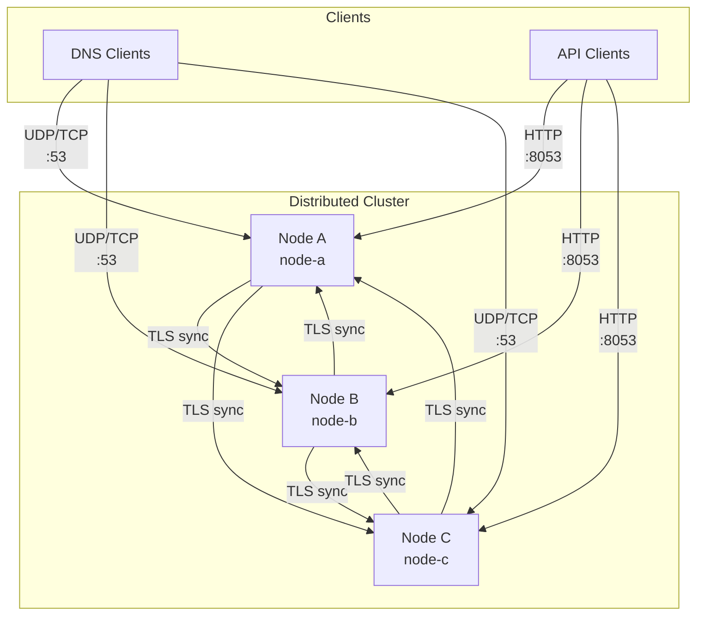
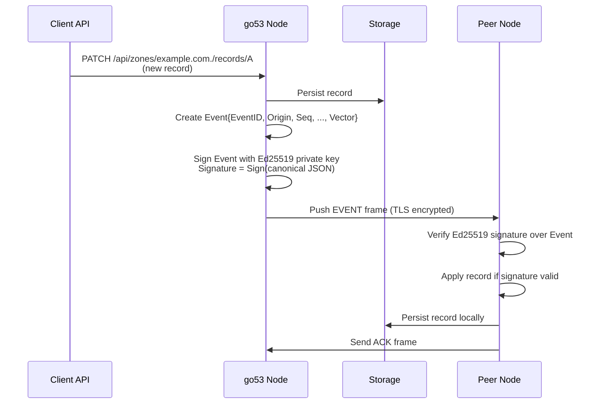
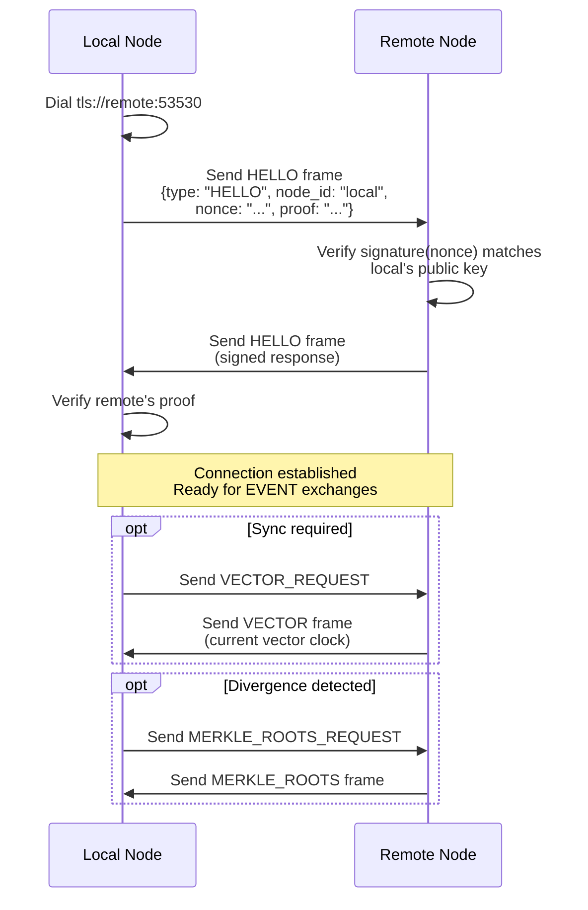
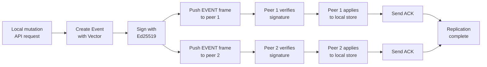
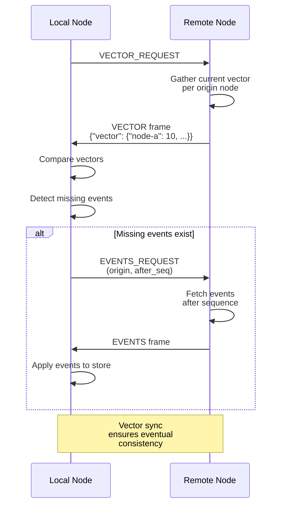
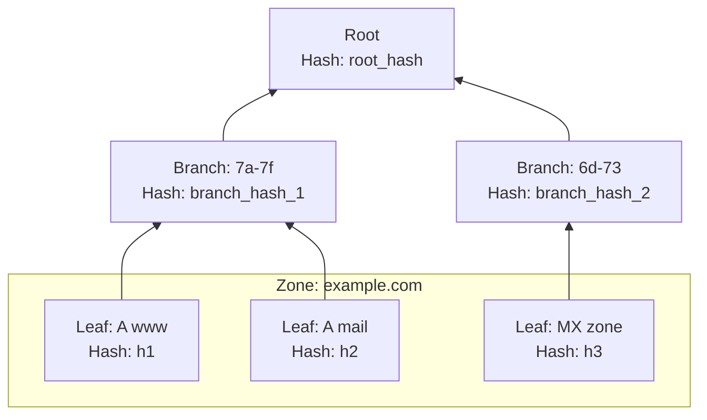
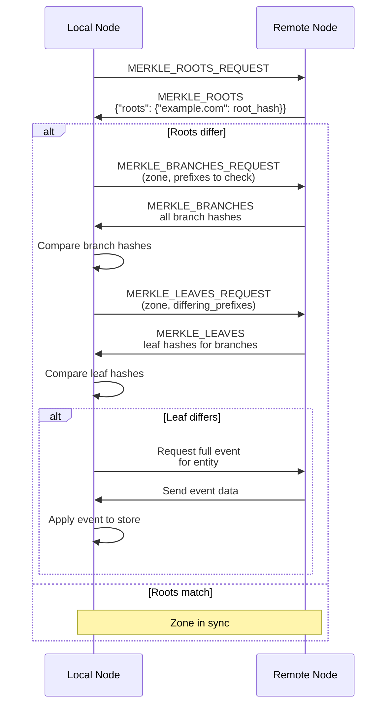
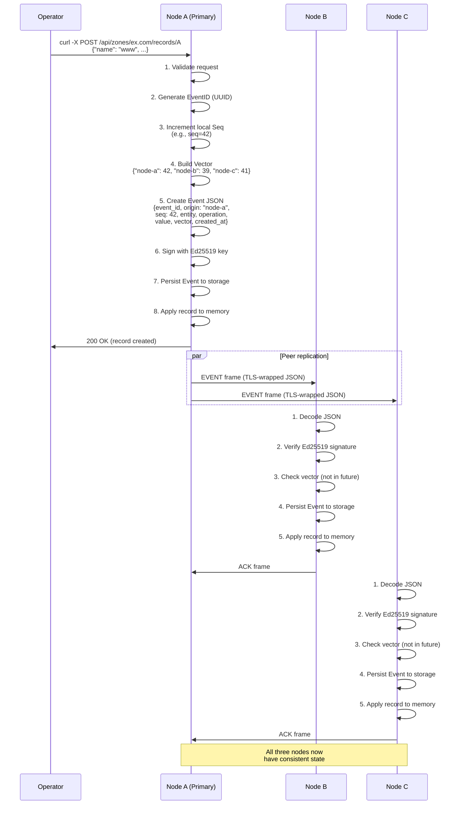

# Distributed Mode Technical Guide

Comprehensive documentation of go53's multi-node replication system, covering
architecture, cryptographic signing, protocol design, vector clocks, and Merkle
tree-based integrity repair.

## Overview

Distributed mode enables multi-node go53 clusters where all nodes accept
mutations locally and replicate state changes to peers through signed events.
This design supports eventual consistency with cryptographic integrity guarantees
and automated repair of divergent state.

Key characteristics:

- **Multi-writer:** Any node can accept DNS record mutations, TSIG key changes,
  DNSSEC key updates, and configuration patches without blocking on peer
  responses.
- **Event-driven:** All state changes are published as signed events that include
  vector clock information for partial ordering.
- **Cryptographically signed:** Every event and handshake frame is signed with
  Ed25519 keys, preventing tampering and providing non-repudiation.
- **Persistent replication:** Nodes maintain long-lived TCP or TLS connections to
  peers, creating a gossip mesh that pushes events immediately.
- **Eventual repair:** Periodic background syncs compare vector clocks and Merkle
  roots to detect and repair state divergence.

> **Use case:** Distributed mode is suited for clusters needing low-latency
> API-driven DNS updates across geographically distributed nodes without
> primary–secondary write constraints.

## Architecture

A go53 distributed cluster consists of independent nodes, each running with
`mode=distributed`. Nodes form a mesh topology where each node is configured with
a set of peer endpoints. In a three-node cluster, for example, each node dials
the other two and accepts incoming connections from them, creating redundancy and
fault tolerance.

### Cluster Topology

The diagram below shows a three-node distributed cluster where events flow
through multiple paths:



Each node exposes three independent listeners:

| Listener | Port | Purpose | Clients |
|----------|------|---------|---------|
| DNS | `:53` (UDP/TCP) | Authoritative DNS query handling | Recursive resolvers, clients |
| API | `:8053` (HTTP/HTTPS) | Zone management, record operations, discovery | Operators, automation, `go53ctl` |
| Sync | `:53530` (TCP/TLS) | Peer-to-peer event replication | Other nodes in the cluster |

### Node Identity

Each node has a stable identity consisting of:

- `node_id`: A string like `node-a` used in event origins, vector clocks, and
  discovery.
- `Ed25519 key pair`: A private key for signing events and HELLO frames, and a
  public key distributed to peers.
- `TLS certificate`: Auto-generated from the Ed25519 key for secure peer
  connections. Public key pinning replaces traditional CA chains.

## Encryption & Security

### Ed25519 Signing

All events and critical handshake messages are signed with Ed25519, a modern
elliptic-curve signature scheme offering 128 bits of symmetric security. go53
uses Ed25519 for three purposes:

1. **Event signatures:** Each event carries a base64-encoded Ed25519 signature
   over the canonical JSON representation of its payload (including EventID,
   Origin, Seq, Entity, EntityType, Zone, RRType, Name, Operation, Value, Vector,
   and CreatedAt).
2. **HELLO frame proof:** The initial handshake frame includes a signed nonce
   challenge-response to verify node identity before accepting sync.
3. **Automatic TLS certificate:** A self-signed X.509 certificate is generated
   from each node's Ed25519 key, presenting the public key in the certificate's
   subject and allowing peers to verify the connection endpoint matches the
   expected node.

### Peer Trust Model

Rather than relying on a certificate authority, distributed mode uses a public
key pinning model:

- Each node is configured with `distributed.peer_public_keys`: a map of peer
  `node_id` to base64-encoded Ed25519 public key.
- When establishing a TLS connection, the peer's certificate is verified to match
  the pinned public key, not a CA signature.
- This avoids the need for external PKI and ensures that only nodes with the
  correct Ed25519 private key can join the cluster.

### Transport Security

The sync socket can operate in four modes:

| Transport | Encryption | Auth | Use Case |
|-----------|------------|------|----------|
| `tcp` | None | Ed25519 signatures only | Development, air-gapped networks |
| `tls` | TLS 1.3, public key pinning | Ed25519 signatures + TLS cert verification | Production, untrusted networks |
| `mtls` | TLS 1.3, mutual auth | Client + server certs, both pinned | Zero-trust networks, strict enforcement |

> **Recommended:** Use `tls` or `mtls` transport in production. TLS 1.3 provides
> modern cipher suites and forward secrecy, while Ed25519 signatures provide
> origin authentication independent of the transport layer.

### Cryptographic Flow

The diagram below illustrates how encryption and signing flow through a typical
replication event:



## Protocol Details

### Transport Layer

The sync protocol uses a persistent TCP or TLS socket with a length-prefixed
frame format. Each frame is a JSON object prefixed by a 4-byte big-endian integer
indicating the frame size in bytes. Frames can reach up to 16 MB.

```text
┌─────────────┬──────────────────┐
│ 4-byte size │ JSON frame body  │
│ (big-endian)│ (UTF-8 encoded)  │
└─────────────┴──────────────────┘
```

This design allows pipelined frames and simple framing without additional
delimiters or escape sequences.

### Connection Lifecycle

Distributed nodes establish sync connections following this sequence:



### Frame Flow During Replication

When a record is created or updated on one node, the event propagates to peers
through the following flow:



## Vector Clocks

### Concept

Vector clocks are a distributed systems primitive that establish a causal partial
order over events. In go53, each event carries a map of `{node_id: sequence_number}`
representing the event clock state at the time of creation.

For example, in a three-node cluster where node-a makes a record change:

```json
{
  "event_id": "abc123...",
  "origin": "node-a",
  "seq": 5,
  "vector": {
    "node-a": 5,
    "node-b": 3,
    "node-c": 4
  },
  "entity": "zone:example.com,rrtype:A,name:www.example.com.",
  "operation": "UPSERT"
}
```

This vector tells us that:

- This is the 5th event originating from node-a.
- At the time this event was created, node-a had seen up to seq 3 from node-b and
  seq 4 from node-c.
- The vector defines a happens-before relationship: any event observed by this
  node before creating the event will have a vector ≤ this one component-wise.

### Causal Ordering

Vector clocks enable conflict resolution without explicit coordination:

- **Same entity, different values:** The event with the higher vector (in
  component-wise comparison) is considered "later" and wins. If neither is ≥ the
  other, both are concurrent and application-level conflict resolution may apply.
- **Detecting missing events:** If a peer's vector shows `node-b: 5` and the local
  node only has up to `node-b: 3`, the sync protocol knows events 4–5 from node-b
  are missing and requests them.

### Sync Protocol

Nodes periodically (default 30 seconds) perform a background sync:



## Merkle Tree Repair

### Motivation

While vector clocks and event replication provide eventual consistency, bugs,
network partitions, or storage corruption can cause two nodes to diverge
silently. Merkle trees provide a compact, cryptographic mechanism to detect these
divergences without comparing entire datasets.

### Tree Structure

For each zone, go53 builds a Merkle tree with two layers:

- **Leaves:** One leaf per entity (a zone, RRtype, and name combination). Each
  leaf is a SHA-256 hash of the entity's JSON representation (including the RRset
  value).
- **Branches:** Leaves are grouped by a 2-character prefix (derived from the
  entity key), and each prefix gets a branch hash computed as SHA-256 of the
  sorted leaf hashes in that branch.
- **Root:** The root hash is computed as SHA-256 of all branch hashes, providing a
  single fingerprint of zone state.

The diagram below illustrates the tree for a zone with a few records:



### Repair Protocol

Periodically, after vector clock sync, nodes compare Merkle roots for each zone:

1. **Request roots:** Local node asks peer for zone Merkle roots.
2. **Compare roots:** If a root differs, the zone is out of sync.
3. **Request branches:** Local node requests all branch hashes for the mismatched
   zone.
4. **Compare branches:** Find which branch prefixes differ.
5. **Request leaves:** Request leaf hashes for differing prefixes.
6. **Compare and repair:** For differing leaf hashes, request the full entity
   values from peer and apply the latest (according to vector clock).

This is more efficient than comparing all zone records directly, as it only sends
necessary details after narrowing down to specific prefixes and entities.



### Cryptographic Integrity

Because each entity value is hashed as part of the leaf computation, and leaves
feed into branches and the root, any undetected corruption is extremely unlikely
to go unnoticed. Additionally, all event data that updates entity values is itself
signed with Ed25519, providing a secondary integrity check.

## Event Replication Flow

### Example: Creating a DNS Record

This section walks through the complete flow when an operator uses the API to
create a record on one node in a three-node cluster:



### Conflict Resolution

If two operators simultaneously create or update the same record on different
nodes, the events will have different vectors and origins. Each node will
eventually receive both events. The conflict resolution rule is simple:

- **Compare vectors:** For the same entity, compute which event's vector is later
  (component-wise ≥).
- **If one is strictly later:** Apply that event. This implements "last write
  wins" semantics with causal awareness.
- **If concurrent (neither ≥):** Nodes will converge on a consistent outcome
  through deterministic conflict resolution (e.g., alphabetically by origin
  node_id, or by comparing the event payloads themselves).

> go53's conflict resolution is deterministic: given the same set of concurrent
> events, all nodes arrive at the same conclusion without further coordination.
> This ensures strong eventual consistency.

## Frame Types

The sync protocol defines distinct frame types for different communication
patterns. All frames are JSON-encoded and length-prefixed.

| Frame Type | Direction | Purpose |
|------------|-----------|---------|
| `HELLO` | Bidirectional | Handshake with nonce, signature proof, and node identity. Verifies peer Ed25519 key. |
| `EVENT` | Unidirectional (push) | Replicates a single signed event (zone record, TSIG key, DNSSEC key, config). |
| `ACK` | Response to EVENT | Acknowledges receipt and processing of an event. |
| `VECTOR_REQUEST` | Unidirectional (request) | Asks peer for its current vector clock state. |
| `VECTOR` | Response to VECTOR_REQUEST | Returns the peer's vector clock: `{"vector": {"node-a": 42, ...}}`. |
| `EVENTS_REQUEST` | Unidirectional (request) | Requests events from a specific origin after a sequence number. |
| `EVENTS` | Response to EVENTS_REQUEST | Returns an array of events matching the request criteria. |
| `MERKLE_ROOTS_REQUEST` | Unidirectional (request) | Requests Merkle root hashes for all zones. |
| `MERKLE_ROOTS` | Response to MERKLE_ROOTS_REQUEST | Returns `{"merkle_roots": {"zone": root_hash, ...}}`. |
| `MERKLE_BRANCHES_REQUEST` | Unidirectional (request) | Requests branch hashes for a zone and optional prefix filters. |
| `MERKLE_BRANCHES` | Response to MERKLE_BRANCHES_REQUEST | Returns branch hashes: `{"merkle_branches": {"prefix": {hash, leaf_count}, ...}}`. |
| `MERKLE_LEAVES_REQUEST` | Unidirectional (request) | Requests leaf hashes for specific branch prefixes in a zone. |
| `MERKLE_LEAVES` | Response to MERKLE_LEAVES_REQUEST | Returns leaf hashes: `{"merkle_leaves": {"entity": leaf_hash, ...}}`. |
| `MERKLE_REPAIR_REQUEST` | Unidirectional (request) | Requests full event data for entities that differ in Merkle leaves. |
| `ERROR` | Response (any) | Signals a processing error; includes an `error` string field. |

### HELLO Frame Structure

The HELLO frame is the first message sent on a sync connection. It establishes
node identity and proves possession of the Ed25519 private key:

```json
{
  "type": "HELLO",
  "node_id": "node-a",
  "nonce": "base64_encoded_random_bytes",
  "proof": "base64_ed25519_signature_of_nonce"
}
```

The receiver verifies the `proof` against the `nonce` using the pinned public key
for the `node_id`. If verification fails, the connection is closed.

### EVENT Frame Structure

The EVENT frame carries a replicated state change:

```json
{
  "type": "EVENT",
  "event": {
    "event_id": "550e8400-e29b-41d4-a716-446655440000",
    "origin": "node-a",
    "seq": 42,
    "entity": "zone:example.com,rrtype:A,name:www.example.com",
    "entity_type": "zone_record",
    "zone": "example.com.",
    "rrtype": "A",
    "name": "www.example.com.",
    "operation": "UPSERT",
    "value": {"ttl": 300, "ip": "192.0.2.1"},
    "vector": {"node-a": 42, "node-b": 39, "node-c": 41},
    "created_at": 1717686400000,
    "signature": "base64_ed25519_signature"
  }
}
```

Peers must:

1. Verify the event's Ed25519 `signature` using the origin node's public key.
2. Check that the vector does not claim a future state (no component > local
   knowledge).
3. Apply the operation (UPSERT or DELETE) to storage and memory.
4. Send an ACK frame.

## Data Model

### Entities

Distributed mode replicates four types of entities, each identified uniquely:

| Entity Type | Entity Key Components | Operations | Replicated |
|-------------|-----------------------|------------|------------|
| Zone Record | `zone:rrtype:name` — e.g. `zone:example.com,rrtype:A,name:www.example.com` | UPSERT, DELETE | Yes |
| TSIG Key | `tsig_key:keyname` — e.g. `tsig_key:update.example.com` | UPSERT, DELETE | Yes |
| DNSSEC Key | `dnssec_key:zone:keyid` — e.g. `dnssec_key:example.com,keyid:12345` | UPSERT, DELETE | Yes |
| Config | `config` | UPSERT | Yes (selective) |

### Event Structure

Each replicated event has the following fields:

| Field | Type | Description |
|-------|------|-------------|
| `event_id` | UUID string | Globally unique event identifier (v4 random). |
| `origin` | String | Node ID of the event originator (e.g., "node-a"). |
| `seq` | uint64 | Sequence number for this origin (incremented per event). |
| `entity` | String | Unique identifier for the data being changed. |
| `entity_type` | String | Type of entity: "zone_record", "tsig_key", "dnssec_key", or "config". |
| `zone` | String | Zone name (for zone records, DNSSEC keys; empty for global config/TSIG keys). |
| `rrtype` | String | RR type in uppercase (for zone records; empty for others). |
| `name` | String | Owner name (for zone records; key name for TSIG keys). |
| `operation` | String | "UPSERT" (create or update) or "DELETE". |
| `value` | JSON object | The data being replicated (RRset, key config, etc.). Null or empty for DELETE. |
| `vector` | Map\<string, uint64\> | Vector clock at event creation: {node_id: sequence_number, ...}. |
| `created_at` | Unix timestamp (ms) | When the event was created. |
| `signature` | Base64 string | Ed25519 signature over canonical JSON of all fields except `signature`. |

### Vector Clock Storage

Each node maintains a persistent `EntityClock` record for every observed origin:

```json
{
  "origin": "node-b",
  "seq": 47,
  "vector": {"node-a": 50, "node-b": 47, "node-c": 45}
}
```

This is used to:

- Determine the next expected sequence number from each peer (for detecting
  missing events).
- Build the vector clock for new local events (incorporating knowledge of all
  peers' progress).
- Detect causality violations or out-of-order event delivery.

### Config Replication

Live configuration changes (e.g., adjusting DNSSEC TTL, enabling EDNS) replicate
as config events. However, node-local settings are excluded:

- **Replicated:** DNSSEC options, TSIG behavior, resolver timeouts, storage
  settings.
- **Not replicated:** `distributed.node_id`, `distributed.private_key`,
  `distributed.peers`, `distributed.peer_public_keys`,
  `distributed.sync_bind_host`, `distributed.sync_port`.

This ensures each node retains its identity and peer configuration independently,
preventing accidental overwrite by a peer's config event.

---

**Related:**

- [Administrator Guide](/guides/administrator-guide/) — setup, bootstrap, and
  operational procedures.
- [Configuration Reference](/reference/configuration/) — all environment and live
  configuration parameters.
- [Storage](/internal/storage/) — persistence behavior and BadgerDB layout.
