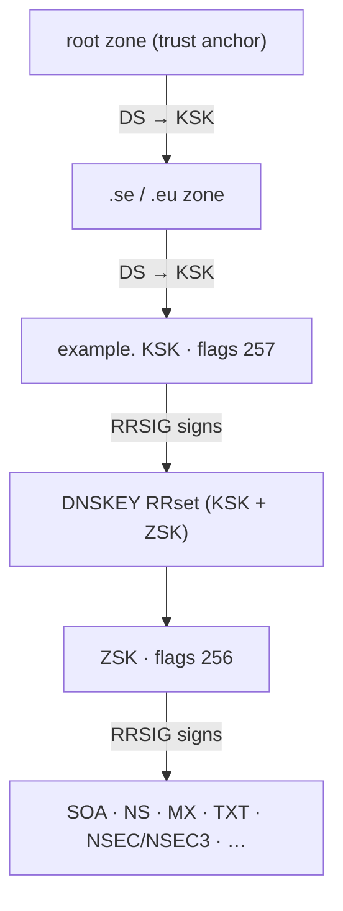
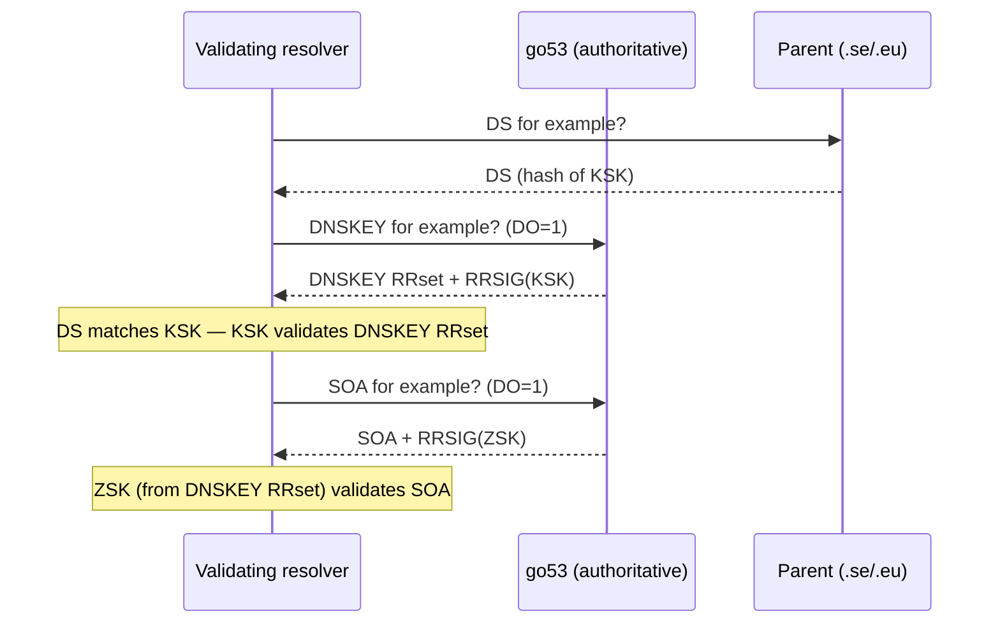
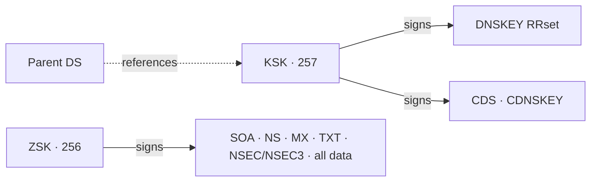
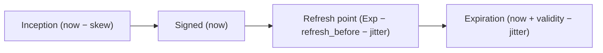
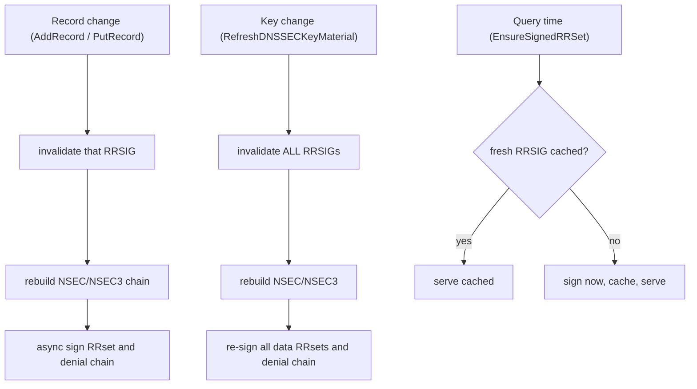
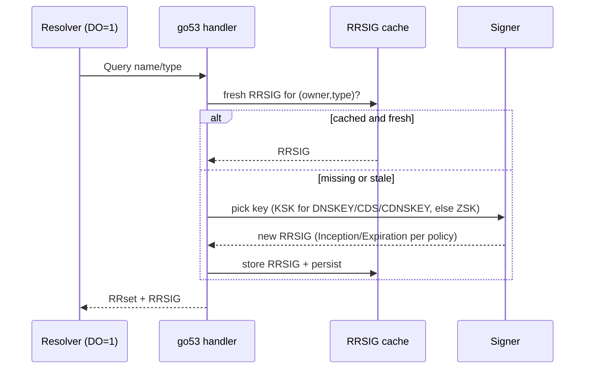
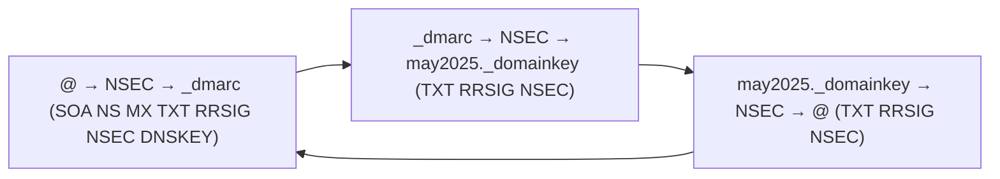
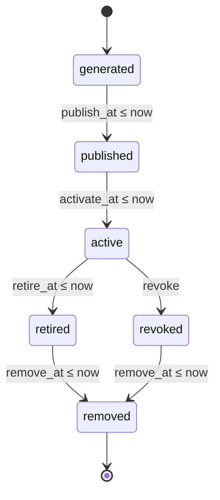

# go53 DNSSEC Technical Guide

How DNSSEC works in go53: the signing model, when and how RRsets are signed,
refresh and jitter timing, authenticated denial with NSEC/NSEC3, parent signaling
with DS/CDS/CDNSKEY, and the key lifecycle — presented against the standard (RFC)
flow and how go53 implements it.

- RFC 4033/4034/4035 · RFC 5155 · 7344 · 8078
- Online query-time signing

## Overview

DNSSEC adds origin authentication and integrity to DNS by signing RRsets with
private keys and publishing the matching public keys (DNSKEY) plus signatures
(RRSIG). A validating resolver builds a chain of trust from the root down to the
queried name using DS records held by each parent zone.

go53 is an **online signer**: zone data is held in memory for fast reads, and
RRSIGs are produced from stored private keys and cached. Signatures are created
on record changes, refreshed before they expire, and (when missing) generated at
query time. NSEC or NSEC3 denial chains are maintained automatically from zone
contents.

- **Signs** — DNSKEY, RRSIG over every authoritative RRset, NSEC/NSEC3 + their
  RRSIGs, and CDS/CDNSKEY parent-signaling records.
- **Stores** — Private keys and generated RRSIGs persist to Badger; the
  in-memory cache serves reads and reuses fresh RRSIGs.
- **Maintains** — NSEC/NSEC3 chains, signature freshness
  (refresh-before-expiry), and parent DS signaling via CDS/CDNSKEY.

DNSSEC is enabled per node with the top-level `dnssec_enabled` flag (the `dnssec`
config block only holds the signature *policy*). On a node where `dnssec_enabled`
is false, or in `secondary` mode, go53 does not sign — a secondary serves the
DNSSEC material it received over AXFR/IXFR.

## Standard DNSSEC (RFC) — the chain of trust

Validation walks from a trust anchor (the root key) downward. Each parent zone
holds a **DS** record that is a hash of the child's Key Signing Key (KSK). The
KSK signs the child's DNSKEY RRset, which contains the Zone Signing Key (ZSK);
the ZSK signs the zone's data. This is the model go53 implements.



*Chain of trust: parent DS authenticates the KSK, the KSK authenticates the
DNSKEY RRset (which carries the ZSK), and the ZSK authenticates zone data.*

A resolver validates an answer by reversing this: verify the data's RRSIG with
the ZSK, verify the DNSKEY RRset's RRSIG with the KSK, and verify the KSK against
the parent's DS — up to the trust anchor.



*RFC validation order; go53 produces every record/signature the resolver asks
for.*

## Key Model: KSK & ZSK

go53 uses a split key set with two roles, distinguished by the DNSKEY *flags*
field:

| Role | Flags | Signs | Referenced by parent DS |
|------|-------|-------|-------------------------|
| **KSK** (Key Signing Key) | `257` | DNSKEY RRset, and CDS/CDNSKEY | Yes |
| **ZSK** (Zone Signing Key) | `256` | All other RRsets (SOA, NS, MX, TXT, NSEC/NSEC3, …) | No |



*Which key signs what. CDS/CDNSKEY are signed by the KSK so the parent can
validate the DS-update signal from its existing DS (RFC 7344).*

> ⚠️ **No CSK (combined signing key).** A key is treated strictly as a KSK or a
> ZSK based on its flags; go53 does not support a single key that signs both the
> DNSKEY RRset and zone data. A zone needs at least one active KSK *and* one
> active ZSK to be fully signed. When migrating from a server that uses a CSK
> (PowerDNS commonly does), import the existing key as the KSK and generate a ZSK
> in go53 — see the [Administrator Guide](/guides/administrator-guide/#dnssec).

## Signing Policy & Timing

The `dnssec` config block controls signature validity and refresh behaviour. All
values are seconds.

| Field | Default | Meaning |
|-------|---------|---------|
| `validity_seconds` | `604800` (7 d) | RRSIG validity window for ordinary RRsets. |
| `dnskey_validity_seconds` | `1209600` (14 d) | RRSIG validity window for the DNSKEY RRset. |
| `refresh_before_seconds` | `86400` (1 d) | Re-sign this long before a signature expires. |
| `jitter_seconds` | `3600` (1 h) | Deterministic spread so signatures don't all refresh/expire at the same instant. |
| `inception_skew_seconds` | `3600` (1 h) | Backdate signature inception to tolerate clock skew between signer and validators. |

When a signature is produced, go53 sets the RRSIG validity fields as:

```text
Inception  = now − inception_skew
Expiration = now + validity − jitter
```

A cached signature is considered **fresh** (reused as-is) while:

```text
now < Expiration − refresh_before − jitter
```

So a 7-day signature with a 1-day refresh window is re-signed roughly on *day 6*
(minus jitter), never at the moment of expiry — a valid signature is always
available with margin. The DNSKEY RRset uses the longer 14-day validity.



*Lifetime of one RRSIG. go53 re-signs at the refresh point, well before
expiration.*

> **Safety clamps.** The policy is self-correcting: if `refresh_before_seconds` ≥
> validity it is reduced to one third of validity, and if `jitter_seconds` ≥ the
> refresh window it is halved. This guarantees a usable refresh window even with
> misconfigured values.

**Important:** refresh timing is driven by the signature's *expiration*, not by
the record's TTL. TTL only controls how long resolvers cache the answer; it has
no effect on when go53 re-signs.

## Jitter

Jitter prevents a "thundering herd" where every signature in a zone expires — and
therefore needs re-signing — at exactly the same time. go53 derives a
**deterministic** jitter per signature from a hash of the owner name, RR type,
and key tag, bounded by `jitter_seconds`.

- Because it is deterministic, the same RRset always gets the same jitter offset
  — refresh decisions are stable across restarts and across nodes.
- Because it varies per (owner, type, key), different RRsets refresh and expire at
  slightly different times, smoothing signing load.
- It is applied both to `Expiration` (at signing time) and to the
  freshness/refresh calculation, so the two stay consistent.

## When Signing Happens

go53 signs in three situations. All signing is skipped when `dnssec_enabled` is
false or the node is a secondary.



*The three signing paths. Mutations and key changes sign proactively (async);
query time fills any gap on demand.*

### 1. On record change

Adding, replacing, or deleting a record invalidates the affected RRset's RRSIG,
rebuilds the denial chain if the change affects names/types, and schedules
signing of that RRset (and the NSEC/NSEC3 chain) in the background.

### 2. On key change

Creating, rolling, or updating the lifecycle of a key — or, in distributed mode,
receiving a replicated key event — runs a full refresh: all RRSIGs are
invalidated and the whole zone (data RRsets *and* the denial chain) is re-signed
with the current keys. This means a key change fully re-signs the zone without
needing a re-import.

### 3. At query time

When answering a DO-bit query, go53 serves a cached RRSIG if it is still fresh;
otherwise it signs the RRset on the spot, caches the result, and returns it. This
guarantees a valid signature is always available even between proactive
refreshes.

## Query-Time Signing & the RRSIG Cache

Generated RRSIGs are cached (and persisted). On each signed answer the cache is
consulted first; only a missing or stale entry triggers a fresh signature. The
signer also picks the correct key for the RRset type: the **KSK** for DNSKEY, CDS
and CDNSKEY, the **ZSK** for everything else.



*Query-time path. Freshness is judged against the policy window, not the TTL.*

## Authenticated Denial: NSEC / NSEC3

DNSSEC must prove that a name or type does *not* exist. go53 maintains a denial
chain over the sorted owner names of the zone and signs it like any other RRset.

- **NSEC** is the default. Each NSEC record points to the next owner name and
  lists the types present at its owner, forming a closed loop around the zone.
- **NSEC3** is enabled per zone by the presence of an `NSEC3PARAM` record in that
  zone. There is no global on/off switch in the `dnssec` block. NSEC3 hashes
  owner names to hinder zone enumeration and supports **opt-out** (flag bit
  `0x01`) to skip unsigned delegations.



*An NSEC chain is a sorted, closed loop of owner names; each link is itself
signed by the ZSK.*

The chain is rebuilt automatically whenever zone contents change, and re-signed by
the denial-chain signer. Switching between NSEC and NSEC3 does not affect the
parent DS and needs no registrar change.

## Parent Signaling: DS, CDS, CDNSKEY

The chain of trust is anchored by the **DS** record in the parent zone — a hash
of your KSK. go53 cannot write the parent zone, so it exposes the DS to submit,
and publishes **CDS**/**CDNSKEY** records that signal a desired DS to the parent
(RFC 7344/8078, "automatic" DS maintenance).

| Record | Lives at | Purpose |
|--------|----------|---------|
| `DS` | Parent zone | Hash of the child KSK; the trust-chain link. Submitted to the registrar/registry. |
| `CDS` | Child apex | "Child DS" — the DS the child wants the parent to publish. Signed by the KSK. |
| `CDNSKEY` | Child apex | "Child DNSKEY" — same intent, as a DNSKEY for registrars that prefer key data. Signed by the KSK. |

> **Note:** Per RFC 7344, CDS and CDNSKEY are signed by a key the current DS
> references — the **KSK** — so the parent can validate the update signal from
> its existing DS. go53 signs CDS/CDNSKEY with the KSK and zone data with the ZSK.

A child's own DS lives only at the parent, never in the child's own zone file. DS
records you *do* see inside a zone belong to signed child delegations and are
ordinary data signed by the ZSK.

```sh
# Get the DS to submit to the registrar (digest type 2 / SHA-256 by default)
go53ctl ds example.com.

# Inspect the published parent-signaling records
go53ctl cds example.com.
go53ctl cdnskey example.com.
```

Some registries accept a DS (key tag, algorithm, digest type, digest); others
accept a DNSKEY and compute the DS themselves. Use SHA-256 (digest type 2); SHA-1
(type 1) is deprecated.

## Key Lifecycle & Rollover

Each stored key carries lifecycle timestamps and a state derived from them. A key
signs only while it is *active* (activated, not yet retired/revoked/removed); it
appears in the published DNSKEY RRset from its publish time.



*Key states are computed from timestamps; pre-publishing a successor before
activating it enables clean rollovers.*

| State | In DNSKEY RRset? | Signs? |
|-------|------------------|--------|
| generated | No | No |
| published | Yes | No (pre-publish) |
| active | Yes | Yes |
| retired | Yes (until removed) | No |
| revoked | Yes, with revoke bit | No |
| removed | No | No |

```sh
# Generate a full KSK + ZSK set for a zone
go53ctl dnskeys create example.com.

# Add a single key of a given role (e.g. a new ZSK)
go53ctl dnskeys rollover example.com. ZSK ECDSAP256SHA256

# Adjust lifecycle timing (pre-publish, activate, etc.)
go53ctl dnskeys lifecycle <keyid> '{"publish_at":...,"activate_at":...}'

# Retire or revoke (optional remove-after days), then delete
go53ctl dnskeys retire <keyid> [days]
go53ctl dnskeys revoke <keyid> [days]
go53ctl dnskeys delete <keyid>
```

A key change re-signs the whole zone (see [When Signing Happens](#when-signing-happens)).
For a KSK rollover, pre-publish the new KSK, publish its DS at the parent, wait
for propagation, then retire the old KSK.

## Algorithms

go53 can generate keys and sign with the algorithms below. Imported zone data may
contain other algorithm numbers as records, but signing is limited to supported
algorithms. Use a single algorithm for both KSK and ZSK to avoid the "every
algorithm must sign every RRset" requirement (RFC 6840).

| Alg | Name | Status |
|-----|------|--------|
| `8` | RSASHA256 | Supported (2048-bit) |
| `10` | RSASHA512 | Supported (2048-bit) |
| `13` | ECDSAP256SHA256 | Supported |
| `14` | ECDSAP384SHA384 | Supported |
| `15` | ED25519 | Supported (rollover default) |
| `16` | ED448 | Not supported |

ECDSA and Ed25519 DNSKEYs publish the raw public key (no point prefix), as
required for DNSSEC.

## DNSSEC in Distributed Mode

In distributed mode every node serves authoritatively and signs locally. DNSSEC
private keys are replicated as signed key events, so each node holds the same key
material and produces its own (equivalent) signatures. Receiving a key event runs
the same full re-sign as a local key change.

> **Note:** Because each node signs from its local key store, all nodes that
> should serve a signed zone must hold the zone's keys. A node that has zone data
> but is missing the keys cannot produce signatures for it.

See the [Distributed Mode](/concepts/distributed-mode/) concept for the
replication design.

## go53ctl Reference (DNSSEC)

| Command | Does |
|---------|------|
| `go53ctl dnskeys list` | List stored DNSSEC keys (includes private material — handle output carefully). |
| `go53ctl dnskeys create ZONE` | Generate and store a default KSK + ZSK set for the zone. |
| `go53ctl dnskeys rollover ZONE ROLE ALG` | Generate a single key of ROLE (`KSK`/`ZSK`) with algorithm ALG. |
| `go53ctl dnskeys lifecycle KEYID JSON` | Update lifecycle timing/state; triggers a full zone re-sign. |
| `go53ctl dnskeys retire KEYID [days]` | Mark a key retired (optional remove-after). |
| `go53ctl dnskeys revoke KEYID [days]` | Mark a key revoked (sets the revoke bit). |
| `go53ctl dnskeys delete KEYID` | Delete a stored key. |
| `go53ctl dnskeys import-private --key-file F` | Import private keys (go53 key-import JSON; ECDSA P-256/P-384, Ed25519). |
| `go53ctl ds ZONE` | Show the DS to submit to the parent/registrar. |
| `go53ctl cds ZONE` / `cdnskey ZONE` | Show the published CDS / CDNSKEY parent-signaling records. |

Verify a signed zone end-to-end with a validator, e.g. `go53ctl zones export ZONE`
piped into `ldns-verify-zone`, or query directly with
`dig @host name TYPE +dnssec`.

See also the [Administrator Guide](/guides/administrator-guide/#dnssec) and the
[Configuration Reference](/reference/configuration/).
