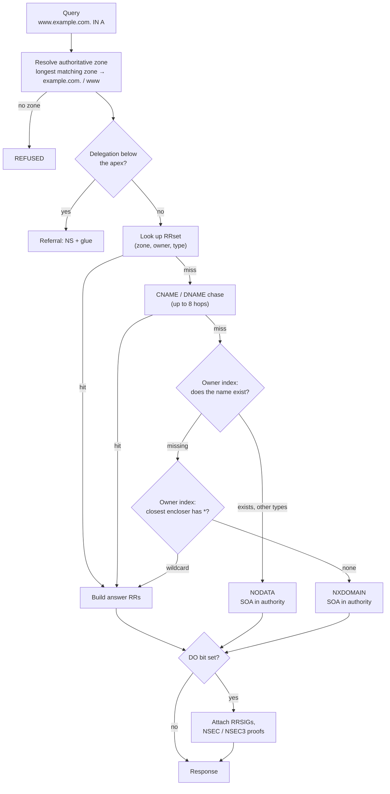
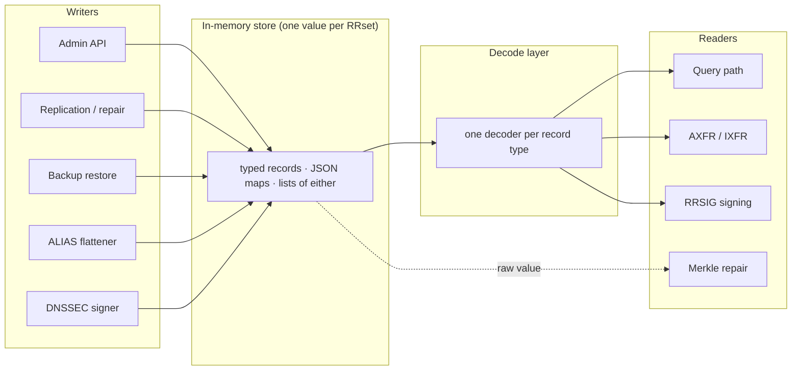
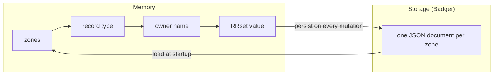
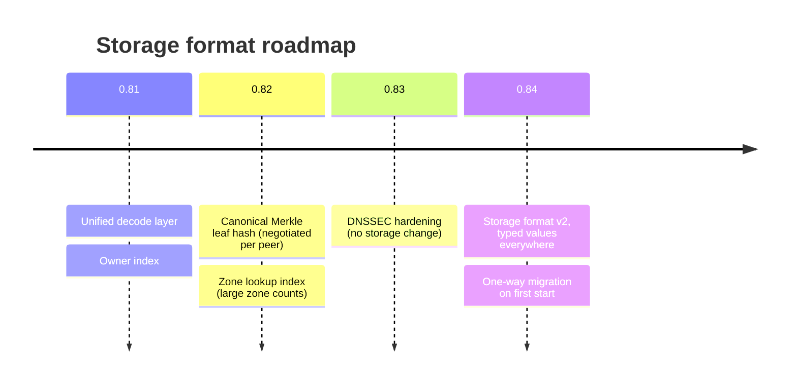

# Query Path & Record Storage

How go53 turns a DNS question into an answer, how zone data is kept in memory
and on disk, and what that means for upgrades. This page describes the engine
as of **0.81**; the last section covers the changes planned for 0.82 and 0.84.

## The Query Path

Every query is served from memory. Storage (the embedded Badger store) is only
read at startup and written on mutation; the query path never touches it.

### Zone Resolution

The store keeps zone names as canonical keys (lower-case, absolute). A query
name is folded once and matched against them by longest suffix, which gives the
zone and the owner relative to it (`www`, or `@` at the apex). The same
resolution is used by every step of the query, so a name can never resolve to
different zones in different steps.

### The Owner Index

Negative answers, wildcard synthesis, delegation checks and DNSSEC denial all
ask the same question for several ancestors of the query name: *does this owner
exist, and with which types?* Since 0.81 the store maintains, per zone, an
index from relative owner name to the set of record types present. Each check
is a single map lookup, and the ancestor walk slices the query string instead
of splitting and re-joining it.

| Check | Uses the index for |
|---|---|
| NODATA vs NXDOMAIN | whether the exact owner exists with any type |
| Wildcard synthesis | the closest existing encloser, then `*.<encloser>` |
| Referrals | the nearest ancestor with NS but no SOA |
| NSEC / NSEC3 denial | closest encloser and next-closer name |

The index is updated in place on every record add and delete, dropped with the
zone, and rebuilt from the data when the server starts. Denial records
(NSEC, NSEC3, RRSIG) do not count as "existing" for these checks, matching
RFC 4035 semantics.

### Record Decoding

Zone data lives in one in-memory store shared by the query path, zone
transfers and DNSSEC signing. A single decode layer turns whatever a stored
value looks like into typed records, so all three paths always agree on what a
zone contains — a class of bug where a record was served but not signed, or
present in AXFR but not answered, cannot recur.

Numbers in stored values are accepted in any integer or float form; a TTL that
is negative, fractional or out of range is treated as missing and the default
of 3600 seconds applies. A delete of a single value from an RRset refuses,
rather than empties the RRset, if the stored value cannot be decoded.

### Cost Model

Measured end to end (`handleRequest`, one query, one core, Go 1.26) on a
single-zone store with DNSSEC off, 0.80.0 against 0.81.0 on the same machine:

| Answer | 0.80.0 | 0.81.0 | Allocations 0.80.0 → 0.81.0 |
|---|---|---|---|
| A (3 addresses) | 6.6 µs | **1.1 µs** | 101 → 14 |
| AAAA | 6.3 µs | **0.9 µs** | 96 → 10 |
| MX at the apex | 6.2 µs | **0.9 µs** | 93 → 10 |
| CNAME chain (2 hops) | 14.7 µs | **1.7 µs** | 221 → 17 |
| NODATA | 23.6 µs | **2.0 µs** | 338 → 10 |
| NXDOMAIN | 38.5 µs | **3.6 µs** | 683 → 13 |

Three changes account for the difference: the name validator no longer
compiles a regular expression on every lookup (the largest single item —
a query performs three to eight lookups), the owner index replaced per-label
scans of every record type, and the unified decoder removed redundant
allocations per lookup. What remains is dominated by resolving the zone for
each lookup step and by building the response message; both are on the
roadmap (see below).

## How Zone Data Is Stored

- **Keys are canonical.** Zone names are stored lower-case and absolute
  (`example.com.`); owner names are stored lower-case and relative to the zone
  (`www`, `_sip._tcp`, `@`). Queries and API calls in any letter case reach
  the same records. NSEC3 owners (upper-case base32 hashes) and RRSIG covered
  types are the deliberate exceptions.
- **Values are stored as written.** The decode layer above reads them; what a
  writer stores is not rewritten, because the stored value is also what
  distributed nodes hash to compare zones (see the Merkle section of
  [Distributed Mode](/concepts/distributed-mode/)).
- **Persistence is per zone.** A mutation re-encodes and writes the whole zone
  document; startup decodes every zone into memory, then rebuilds the owner
  index and the DNSSEC denial chains.

## Upgrades And Data Migrations

go53 reads data written by earlier releases and migrates it in place on the
first start. Migrations run under the same lock as normal writes, before the
server answers its first query.

| Migration | Introduced | What happens on first start | Reversible |
|---|---|---|---|
| Canonical keys | 0.80.0 | Zone and owner keys written in mixed case are re-persisted lower-case; the old keys are deleted. Duplicate keys that differ only in case are merged, canonical entry winning. | No — after upgrading, do not downgrade below 0.80 |
| Owner index | 0.81.0 | Derived from the data at startup; nothing is persisted. | Yes |

Skipping releases is supported: the migration path from 0.79.0, 0.79.2 and
0.80.0 directly to 0.81.0 is verified before each release with a persistent
data volume, DNSSEC keys and mixed-case zone names.

### Planned Storage Changes

- **0.82 — canonical Merkle hash.** Distributed nodes will compare zones by a
  hash of the decoded records rather than of the stored bytes, so that two
  nodes holding the same records always agree. Both hash algorithms ship in one
  binary and the canonical one is used only when both peers support it, so a
  rolling upgrade stays consistent.
- **0.84 — storage format v2.** Every writer stores typed values and startup
  migrates older data once. **In distributed mode this requires that every
  node already runs 0.82 or later**; single-node installations can upgrade
  directly. This will be the only upgrade with a mandatory intermediate
  release.
