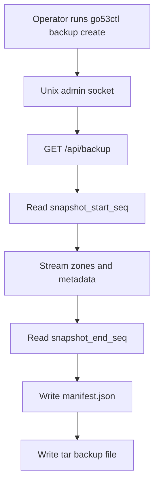
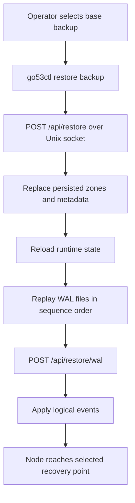
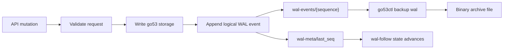

# go53 Backup and WAL

go53 supports live full backups plus a compact binary logical WAL. Backup and
restore commands are intentionally local-first and use the same Unix admin socket
as `go53ctl`.

> ⚠️ **Backups and WAL files contain secrets in cleartext.** A full backup
> includes DNSSEC **private keys**, TSIG **secrets**, and the API `x_auth_key`;
> WAL exports carry the same material as it changes. Treat backup tarballs and
> WAL archives as sensitive: store them with restrictive permissions
> (e.g. `0600`, owner-only), keep the archive directory off world-readable
> paths, and encrypt them at rest if they leave the host. Anyone with a backup
> can impersonate the zone (re-sign it) and the admin API.

## Overview

A full backup is a tar stream containing a manifest, zones, runtime config, TSIG
keys, DNSSEC key material, and WAL metadata. The manifest records the WAL
sequence visible at the start and end of the snapshot as `snapshot_start_seq` and
`snapshot_end_seq`.

The WAL is a go53 logical log, not a Badger-specific log. Mutating API operations
append compact binary events for zone records, zone imports/deletes, config
changes, TSIG key changes, and DNSSEC key changes (create, rollover, lifecycle,
retire, revoke, delete). This keeps the design compatible with a future storage
backend because recovery replays go53 operations instead of database pages, and
it means a point-in-time restore reproduces DNSSEC key state, not just zone data.

> **Note:** Backup and restore endpoints are local-admin operations. Use
> `go53ctl` over the Unix socket; do not expose these operations on the normal
> TCP admin API.

### Backup Flow



## Commands

| Command | Purpose |
|---------|---------|
| `go53ctl backup create --out FILE` | Write a full tar backup. |
| `go53ctl backup wal --after SEQ --out FILE` | Export binary WAL events after a known sequence. |
| `go53ctl backup wal-follow --dir DIR` | Continuously archive new WAL segments into a directory. |
| `go53ctl restore backup FILE` | Restore a full backup into the running local instance. |
| `go53ctl restore wal FILE` | Replay one exported WAL file into the running local instance. |

```sh
# Create a full backup.
go53ctl backup create --out /backup/go53/base.tar

# Read the WAL sequence recorded by the backup.
tar -xOf /backup/go53/base.tar manifest.json

# Export WAL after the backup's snapshot_end_seq.
go53ctl backup wal --after 123 --out /backup/go53/wal/go53-wal.g53wal

# Archive WAL continuously. The follower stores its last exported sequence
# in DIR/.go53-wal-follow.seq and writes segment files atomically.
go53ctl backup wal-follow --dir /backup/go53/wal --interval-sec 60

# Restore the base backup, then replay archived WAL.
go53ctl restore backup /backup/go53/base.tar
go53ctl restore wal /backup/go53/wal/go53-wal-00000000000000000124-00000000000000000180.g53wal
```

## Point-In-Time Restore

The normal recovery chain is a full backup followed by WAL files whose first
sequence is greater than the backup manifest's `snapshot_end_seq`. Restore the
base backup first, then replay WAL files in sequence order until the desired
point.

For precise recovery targets, archive WAL frequently enough that each segment is
an acceptable recovery boundary. A WAL restore applies the complete exported file.

### Restore Flow



Restore replaces persisted state in the running node and reloads runtime data
afterward. While a restore runs, go53 **excludes concurrent state-changing API
requests** with an internal gate: ordinary mutations (record, zone, config, TSIG,
DNSSEC key changes) share access with each other but block for the duration of a
restore, on both the TCP API and the admin socket. Read-only requests and DNS
query serving are never gated. In-flight DNSSEC signing is also drained before
the restore touches storage, so background work cannot clobber restored state.

Both restore paths reload in-memory runtime state when they finish — the zone
store, live config, the TSIG key cache, and the DNSSEC key cache — so a restored
node signs with the restored keys without a process restart.

### Restore upload size

Restore reads the whole backup or WAL file into memory, so the upload is capped
at `max_restore_bytes` (default `1073741824`, i.e. 1 GiB) to bound memory. Raise
it before restoring a larger backup, or set it to `0` to disable the cap:

```sh
go53ctl config patch '{"max_restore_bytes":5368709120}'   # 5 GiB
go53ctl config patch '{"max_restore_bytes":0}'            # unlimited
```

An over-sized upload is rejected rather than risking an out-of-memory restore.

## Retention

`wal_retention_days` controls how long go53 keeps internal WAL events in storage.
The default is `14`. Set it to `0` to keep internal WAL events indefinitely.

```sh
go53ctl config set wal_retention_days 30
go53ctl config patch '{"wal_retention_days":30}'
```

Retention only prunes the internal WAL stored by go53. Files written by
`go53ctl backup wal` or `go53ctl backup wal-follow` are external archives and must
be rotated by the operator.

### Retention is export-status aware

Retention never prunes WAL that an archiver has not yet stored. `go53ctl backup
wal-follow` acknowledges each segment to the server (`POST /api/backup/wal/ack`)
*after* it has been durably written, advancing an archived watermark
(`archived_seq`, visible in `go53ctl` WAL status). `PruneOlderThan` only deletes
events that are **both** older than `wal_retention_days` **and** at or below that
watermark — so a lagging or stopped archiver can never lose un-archived WAL, even
with a short retention window. The watermark is monotonic, so retries are safe.

When no archiver has acknowledged anything (`archived_seq` is `0`), retention
falls back to plain time-based pruning, so deployments that do not archive WAL
stay bounded. In short: run `wal-follow` if you rely on WAL for point-in-time
recovery, and retention will protect exactly the segments it has not archived
yet.

## Format

Exported WAL files are binary files with the magic header `GO53WAL1`. Each record
is length-prefixed and includes a checksum so truncated or corrupted exports fail
during decode.

### WAL Event Flow



| Stored data | Description |
|-------------|-------------|
| `wal-events/{sequence}` | Internal binary logical WAL events in sequence order. |
| `wal-meta/last_seq` | The latest allocated WAL sequence number. |
| `.go53-wal-follow.seq` | Archive follower state file in the selected export directory. |

## Operations

Store backup tar files and exported WAL files outside the Badger directory. A
common layout is one directory for base backups and one append-only archive
directory for WAL segments.

Run `go53ctl backup wal-follow` under a service manager if continuous archiving is
required. Monitor the archive directory and the follower state file so retention
in go53 cannot remove WAL that has not yet been exported.

See also the [Administrator Guide](/guides/administrator-guide/#backup-wal-and-point-in-time-restore)
for the quick-start backup workflow and the
[Configuration Reference](/reference/configuration/) for `wal_retention_days`.
